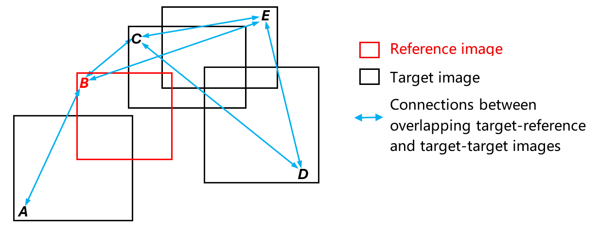
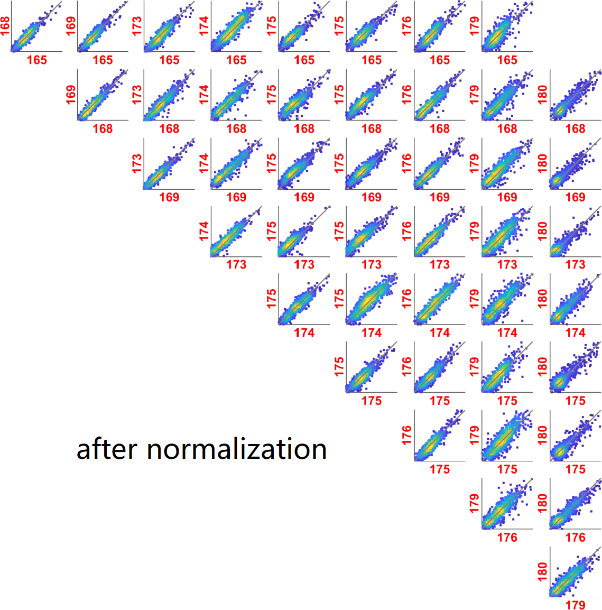

This repository provides MATLAB code for the Least-Squares Spatio-Temporal Adjustment Algorithm (LSSTAA) that conducts relative radiometric normalization of satellite time series. It was demonstrated on PlanetScope Dove-Classic and Dove-R data (2025, ISPRS).

LSSTAA constructs a network graph connecting overlapping images (shown below), where each con represents their radiometric relationship. The optimal solution for the entire network is then obtained through a least-squares adjustment, a well-established technique in surveying and photogrammetry.

  

<em>Connection network</em>

&nbsp;

The key feature of LSSTAA is its ability to maintain radiometric consistency between all connected overlapping images. As shown in the scatterplots below, the data points align along the 1:1 line after normalization.

  

<em>Pairwise scatterplots before and after normalization (obtained from test data 1 blue band; the numbers are images' 'Day of Year')</em>

The figure below shows example mosaics before and after normalization. The LSSTAA effectively reduces seamlines and inter-image brightness and color differences in the mosaic, reflecting consistent radiometry in normalized time series.

  
  

<em>Example mosaics before and after normalization (obtained from test data 1)</em>

## Usage

1. **Prepare input data**  
   Place the following three files in the same folder:
   - A binary image stack of the multispectral time series with BSQ interleave  
   - The corresponding ENVI header file (`*.hdr`)  
   - A text file named `doy.txt` storing the day of year (DOY) of each image in the time series  

   See the provided example dataset `data/data1.zip` for reference.

2. **Set up the script**  
   Open `Demo_LSSTAA_v1.m` and set the following variables:
   - `dataDir` — path to the folder containing the three files  
   - `filename_hdr` and `filename_data` — names of the header and binary data files  
   - `show_scatterplots = 1;` if you want to display pairwise scatterplots during processing

3. **Run the script**  
   Execute the script in MATLAB.  
   The results (normalized time series stack with a .hdr file, per-band normalization coefficients, three pairs of example mosaics) will be saved automatically in a new folder named **`output`** within the data directory.

### Data

Two datasets are provided in the `data/` folder:
- **data1.zip** — PlanetScope time series used for testing.  
  It contains the last 10 images of the Site I dataset described in the paper, acquired over Bié Province, Angola.  
  The images were resampled by a factor of 10 for faster computation, and only ten images were included to allow effective visualization of pairwise scatterplots (using the full series would make scatterplots too dense and time-consuming to render).  
- **data1_results.zip** — example output of per-band normalization coefficients generated by LSSTAA using test data 1 for reference.

### Notes

1. It is recommended to resample the time-series data by a factor of 10 or 20 for faster computation.  
2. The code to apply normalization coefficients to the original full-resolution GeoTIFF images is not included in this release. The current output is a binary image stack.  
3. The code for data preparation (creating image stack, generating "doy.txt" file, and performing optional resampling) is not included in the current release. It is available upon request.
4. Two intermediate files ("temporal_diff_map.ndvi" and "tmp_rsqs.mat") are saved in the output folder. Once generated, they are automatically used in future runs to save computation time. If the input data are changed or any modifications are made to PIF identification, these intermediate files should be deleted and regenerated.
5. The reference can be manually set to user-preferred image(s), such as those with more natural color tones. See comments in Step 2 of Demo_LSSTAA_v1.m.

## Citation

Yan, L., Roy, D. P., & Huang, H. (2026). [*A least-squares spatio-temporal adjustment algorithm (LSSTAA) for radiometric normalization of PlanetScope time series*](https://www.sciencedirect.com/science/article/pii/S0924271625004174#f0035). ISPRS Journal of Photogrammetry and Remote Sensing, 231, 394–413.

For questions or feedback, please use the corresponding author’s email provided in the paper.

